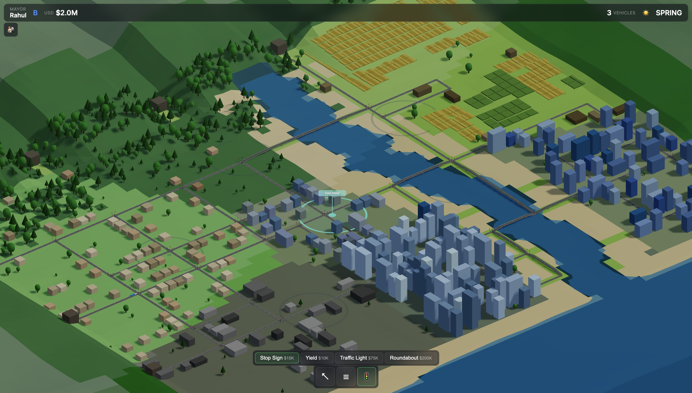
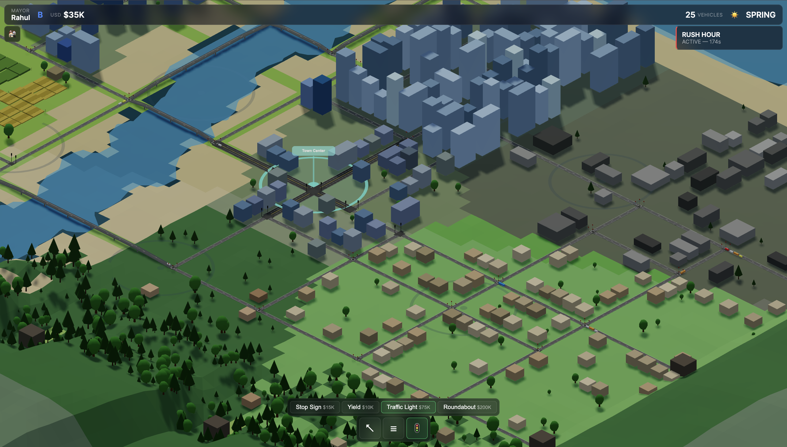

# Traffic Sim 2026

[](LICENSE)
[](https://openjdk.org/projects/jdk/17/)
[](https://nodejs.org/)
[](https://threejs.org/)

A browser-based city traffic management sandbox. Play as Mayor: build roads, install signals, react to weather events, and grow a small town into a multi-district metropolis.





## Tech Stack

| Layer  | Technology                                  |
| ------ | ------------------------------------------- |
| Server | Java 17 · Micronaut 4.7.6 · Netty WebSocket |
| Client | TypeScript 5.7 · Three.js 0.170 · Vite 6    |
| Build  | Gradle 8 (Kotlin DSL) · npm                 |

## Prerequisites

- **Java 17+** (`java -version`)
- **Node.js 20+** (`node -v`)

## Setup & Run

### 1. Server

```bash
./gradlew :server:run
```

Starts on **http://localhost:8000**. The server also serves the compiled client bundle from `classpath:public`.

### 2. Client (development)

```bash
cd client
npm install
npm run dev
```

Opens on **http://localhost:3000** with hot-reload and a WebSocket proxy to `:8000`.

### 3. Client (production build)

```bash
cd client
npm run build
```

Output lands in `client/dist/`. Copy to `server/src/main/resources/public/` to serve through Micronaut's static resource handler.

### Full build (no tests)

```bash
./gradlew build -x test
```

## Project Structure

```
engine/   - Graph, entity-component, pathfinding, and simulation core
game/     - Domain logic: procedural map gen, vehicle AI (IDM), all systems
shared/   - Protocol DTOs shared between server and client
server/   - Micronaut 4 WebSocket server + REST endpoints
client/   - Three.js isometric renderer + TypeScript game client
docs/     - Game design documentation and screenshots
```

## Gameplay

- **Start** in the Residential district and unlock adjacent areas as vehicle delivery milestones are met
- **Upgrade** roads from Local → Collector → Arterial → Highway by clicking on them
- **Install** stop signs, yield signs, and traffic signals at intersections
- **React** to dynamic weather, seasons, and random traffic events
- **Rating** runs from F to S; higher ratings multiply currency income

Full mechanics are documented in [docs/GAME_DOCUMENTATION.md](docs/GAME_DOCUMENTATION.md).

## License

MIT. See [LICENSE](LICENSE).
